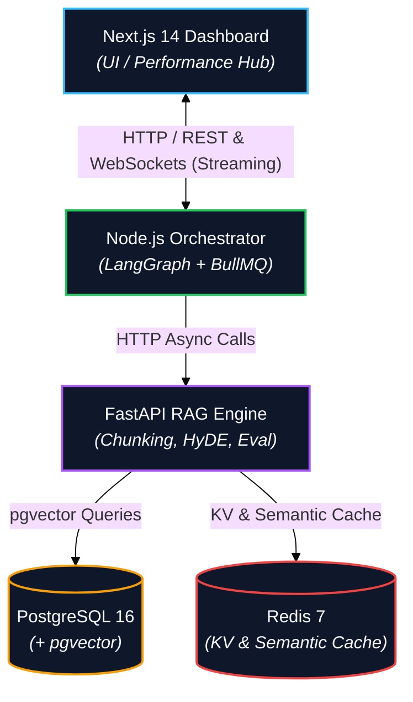
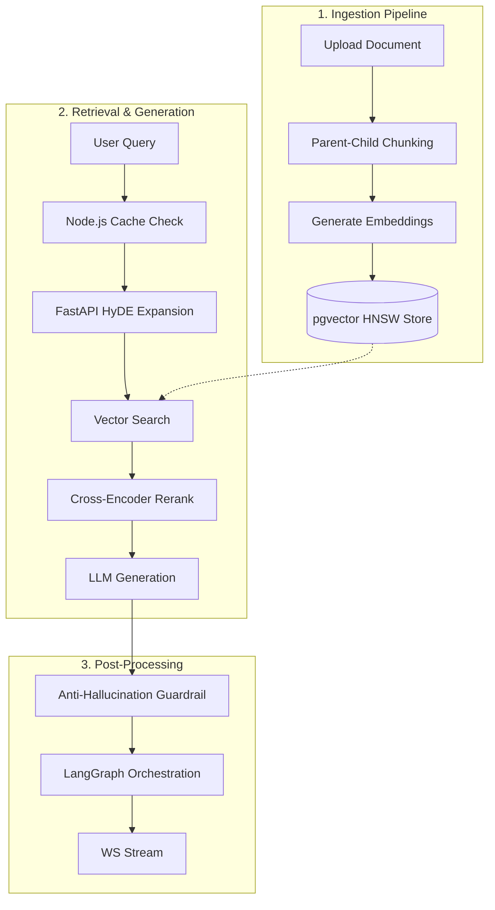
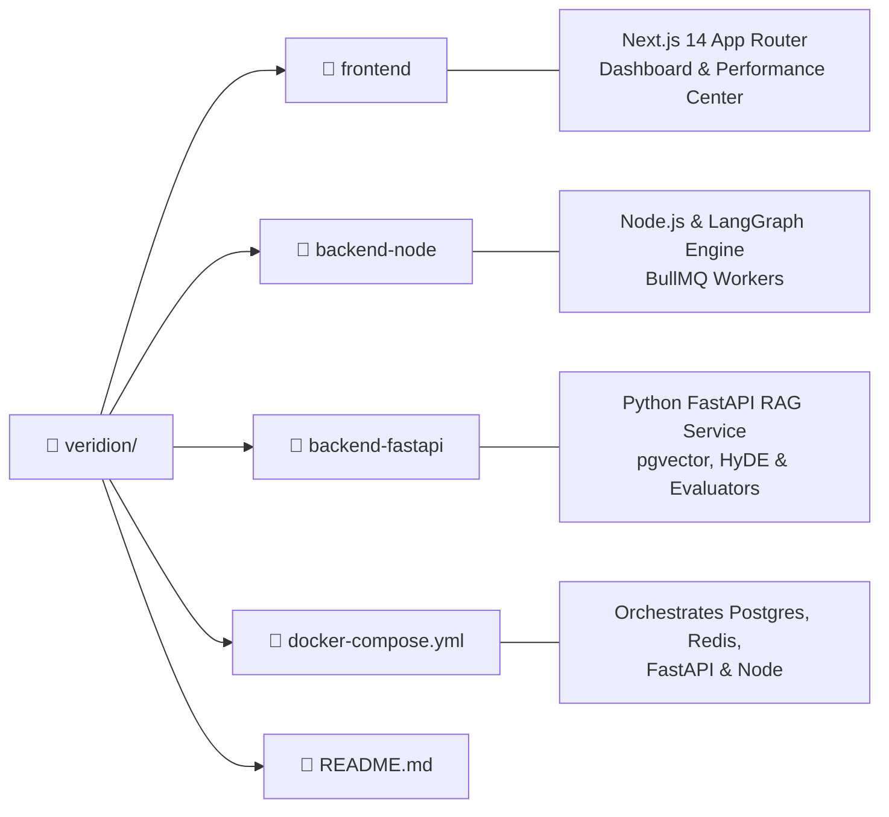
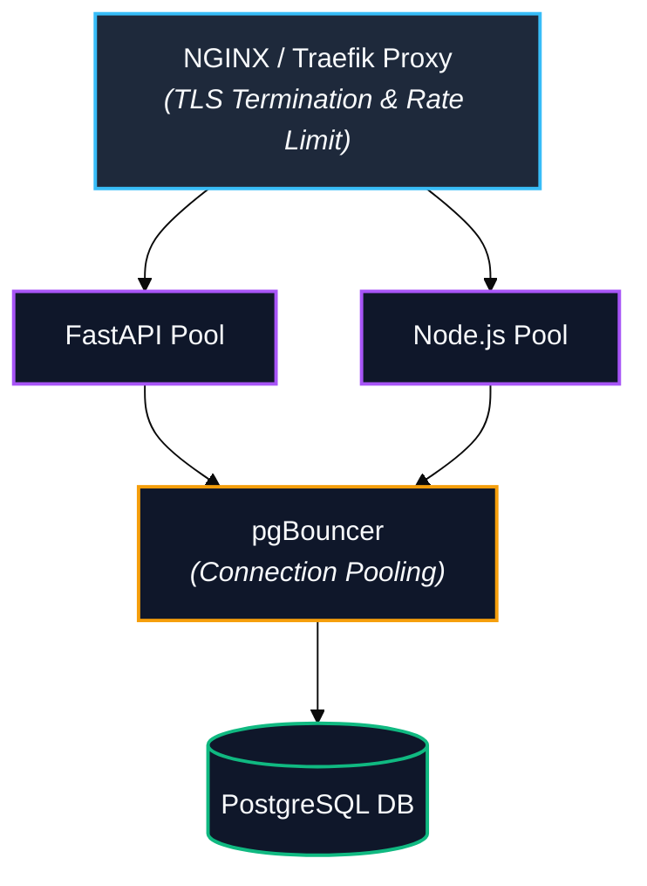

# Veridion

> AI Powered Regulatory Version Intelligence Platform

Veridion is a multi agent regulatory compliance platform that leverages LangGraph, FastAPI, and Next.js to provide version aware document retrieval, hybrid vector search, and real time performance monitoring. It orchestrates autonomous agents for legal verification, summarization, and visualization while managing human in the loop review queues and streaming execution states to the dashboard.

[](https://github.com/your-org/veridion/tree/main/backend-fastapi) [](https://github.com/your-org/veridion/tree/main/backend-node) [](https://github.com/your-org/veridion/tree/main/frontend) [](https://www.docker.com/) [](https://www.postgresql.org/) [](https://redis.io/)

---

## Product Demo


---

## 📁 Project Documentation

>For detailed documentation, please refer to the following repositories:

- Frontend Documentation: [](veridion-frontend/README.md)
- Node.js Orchestrator Documentation: [](veridion-node/README.md)
- FastAPI RAG Engine Documentation: [](veridion-fastapi/README.md)


---

## Architecture Overview





---

## Features

- **Version Aware Document Retrieval**: Query specific versions of acts, regulations, and compliance updates with temporal metadata filtering.
- **Parent Child Chunking**: Retains top level document context (Parent) while matching fine grained search vectors (Child).
- **pgvector Hybrid Search**: HNSW index backed vector search paired with structural metadata filters.
- **HyDE Query Expansion**: HypoDoc generator generates synthetic compliance responses to maximize vector similarity recall.
- **Cross Encoder Reranking**: Re scores top $K$ candidates to eliminate retrieval noise before LLM context injection.
- **Multi Tier Caching**: Dual layer caching strategy with a FastAPI Redis KV embedding cache and a Node.js semantic workflow cache.
- **LangGraph Multi Agent Workflow**: Autonomous agents (Verifier, Summarizer, Visualizer) execute state graph reasoning tasks.
- **BullMQ Human in the Loop (HITL)**: Asynchronous task queues route low confidence agent responses for human review.
- **WebSocket Agent Streaming**: Live execution feedback, agent states, and token streaming broadcast directly to the dashboard.
- **Evaluation & Guardrails**: On the fly hallucination checks, context precision scoring, and ground truth verification.
- **Performance Center**: Real time performance dashboard for latency decomposition, streaming throughput, cache hit ratios, and memory profilers.

---

## Technology Stack

### Frontend Layer
- **Framework**: Next.js 14 (App Router)
- **Styling**: Tailwind CSS, shadcn/ui, Framer Motion
- **State & Data**: Zustand, TanStack Query (v5)
- **Forms & Validation**: React Hook Form, Zod
- **Visualizations**: Recharts, Lucide Icons

### Orchestration Layer (Node.js)
- **Runtime**: Node.js v20 (TypeScript)
- **Orchestration**: LangGraph, LangChain
- **Queue System**: BullMQ
- **Real-Time**: WebSockets (`ws`)

### Engine Layer (FastAPI)
- **Framework**: FastAPI (Python 3.12, AsyncIO)
- **Vector DB & ORM**: PostgreSQL 16 + `pgvector`, SQLAlchemy (Async)
- **Cache**: Redis 7
- **Models**: Google Gemini 2.5 Pro/Flash, OpenAI Embeddings (`text-embedding-4-small`), HuggingFace Cross-Encoders

---

## System Workflow



---

## Project Structure



---

## Running Locally

### Prerequisites
- Docker Engine v24+ and Docker Compose v2+
- Node.js v20+ and Python 3.12+ (if running outside containers)
- API Keys: `GEMINI_API_KEY`, `OPENAI_API_KEY`

### Quickstart

1. **Clone the Repository**
   ```bash
   git clone [https://github.com/your-org/veridion.git](https://github.com/your-org/veridion.git)
   cd veridion
   ```
2. **Set Environment Variables**
   Create a `.env` file in the root directory with the following:
   ```env
   GEMINI_API_KEY=your_gemini_api_key
   OPENAI_API_KEY=your_openai_api_key
   ```
3. **Start Services**
   ```bash
   docker-compose up --build
   ```
4. **Verify Running Services**
   - Next.js Dashboard: http://localhost:3000
   - Performance Center: http://localhost:3000/performance
   - FastAPI OpenAPI Specs: http://localhost:8000/docs
   - Node.js Orchestration API: http://localhost:4000/health

---

## Roadmap

- [x] Version Aware Hybrid Vector Retrieval
- [x] Multi Agent Orchestration with LangGraph
- [x] Asynchronous HITL Queues via BullMQ
- [x] Performance Telemetry Dashboard

**Production Improvements**

**Architectural Note for Reviewers**: This repository represents the functional MVP development phase. The following production grade infrastructure concerns were intentionally omitted from local Docker Compose for developer velocity, but are designed into the target production architecture:



- Authentication & RBAC: Implementation of OAuth2, OpenID Connect (OIDC), granular tenant separation, and JWT access tokens with fine grained policy enforcement.

- Connection Pooling (pgBouncer): Deployment of pgBouncer between application services and PostgreSQL to prevent socket exhaustion, manage transient connections, and sustain high request concurrency across scaled FastAPI and Node instances.

- Edge Reverse Proxy & Ingress: NGINX / Traefik ingress controller to handle SSL termination, rate limiting, CORS policy enforcement, and request routing.

- Container Orchestration: Production deployment via Kubernetes (EKS/GKE) using Helm charts, automated Horizontal Pod Autoscaling (HPA), and zero downtime rolling upgrades.

- Observability & Tracing: Distributed tracing via OpenTelemetry instrumentation exported to Jaeger/Grafana Tempo, paired with Prometheus metrics and Sentry error tracking.

- High Availability Storage: Redis Sentinel cluster mode for automatic failover, managed PostgreSQL read replicas, automated WAL backups, and point in time recovery (PITR).

---

## License

This project is licensed under the [MIT License](https://mit-license.org/).