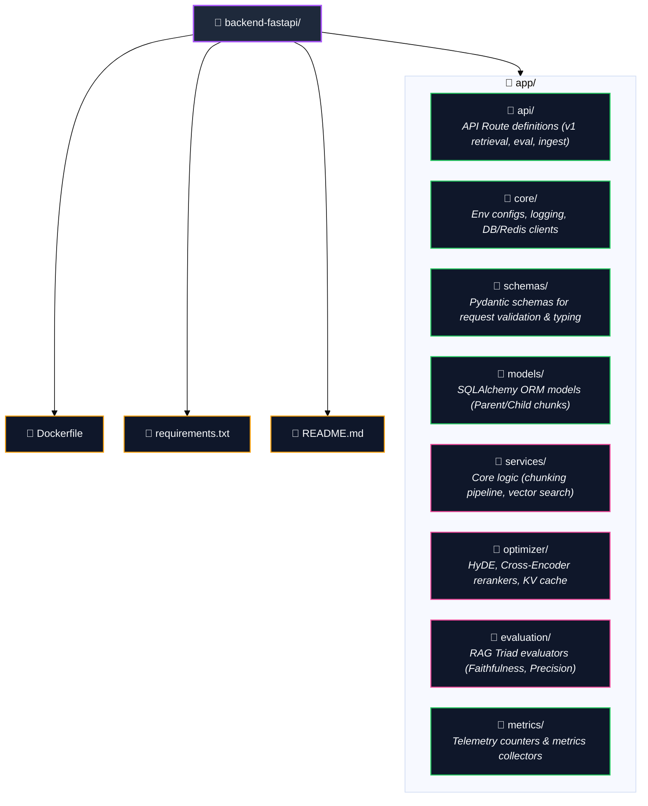
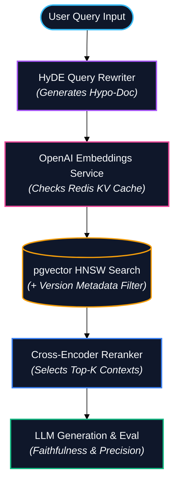

# Veridion — RAG & Retrieval Engine (FastAPI)

> High-performance vector retrieval, hierarchical document processing, HyDE expansion, and RAG evaluation service.

---

## Overview & Responsibilities

The FastAPI engine serves as the core intelligence layer for regulatory document processing and retrieval. It exposes async endpoints optimized for high-throughput vector search over `pgvector`, query manipulation, context reranking, embedding caching, and automated output evaluation.

### Core Responsibilities
- **Document Ingestion**: Parsing, sanitizing, and processing regulatory legal texts.
- **Hierarchical Chunking**: Parent-Child document segmentation preserving overarching section context.
- **Vector Embeddings & Storage**: High-dimensional vector generation and storage in PostgreSQL via `pgvector` with HNSW indexing.
- **HyDE Query Expansion**: Generating Hypothetical Documents to improve dense retrieval recall.
- **Reranking**: Cross-Encoder scoring to filter out irrelevant candidates.
- **Caching**: Multi-key Redis KV embedding store to eliminate redundant embedding operations.
- **RAG Evaluation**: On-the-fly measurement of Context Precision, Context Recall, and Faithfulness (Anti-Hallucination).

---

## Service Folder Structure


---

## Retrieval Pipeline Architecture



## Database Schema (PostgreSQL + pgvector)

```sql
-- Parent Document Entity
CREATE TABLE document_parents (
    id UUID PRIMARY KEY DEFAULT gen_random_uuid(),
    title VARCHAR(255) NOT NULL,
    version VARCHAR(50) NOT NULL,
    metadata JSONB DEFAULT '{}'::jsonb,
    created_at TIMESTAMP WITH TIME ZONE DEFAULT CURRENT_TIMESTAMP
);

-- Child Vector Chunks Entity
CREATE TABLE document_child_chunks (
    id UUID PRIMARY KEY DEFAULT gen_random_uuid(),
    parent_id UUID REFERENCES document_parents(id) ON DELETE CASCADE,
    chunk_text TEXT NOT NULL,
    embedding vector(1536), -- OpenAI text-embedding-3-small dimension
    chunk_index INT NOT NULL,
    metadata JSONB DEFAULT '{}'::jsonb
);

-- HNSW Vector Index
CREATE INDEX idx_child_chunks_embedding 
ON document_child_chunks 
USING hnsw (embedding vector_cosine_ops) 
WITH (m = 16, ef_construction = 64);
```

## RAG Evaluation Framework

The service embeds real-time evaluation steps into every synthesis request:

- Anti-Hallucination Guardrail: Verifies that every assertion made in the generated response directly correlates with extracted context blocks.

- Context Precision: Evaluates the signal-to-noise ratio within retrieved child chunks.

- Context Recall: Verifies whether all necessary regulatory facts were fetched relative to the target ground truth.

## Local Docker Setup

The FastAPI service is managed via Docker Compose alongside PostgreSQL and Redis:

```Bash
docker compose up --build fastapi
```

Service endpoints will be available at:

- Interactive Documentation: http://localhost:8000/docs

- Health Check: http://localhost:8000/health

## Production Improvements

For enterprise deployment, the following backend architecture enhancements are planned:

- Connection Pooling (pgBouncer): In production, deploy pgBouncer between application services and PostgreSQL to reduce connection overhead, improve concurrency, and protect the database under high request volumes. This complements SQLAlchemy pooling and is especially valuable when running multiple FastAPI and Node.js instances.

- Database Migrations: Replace runtime schema initialization with Alembic revision control scripts.

- Authentication & RBAC: Integrate OAuth2 JWT middleware validating signatures directly at the router level.

- Metrics & Observability: Expose native /metrics endpoints for Prometheus scrapping and integrate OpenTelemetry auto-instrumentation for distributed request tracing.

- API Rate Limiting & Circuit Breakers: Implement Redis-backed token-bucket rate limiting per tenant, paired with resilience circuit breakers around external LLM provider calls.