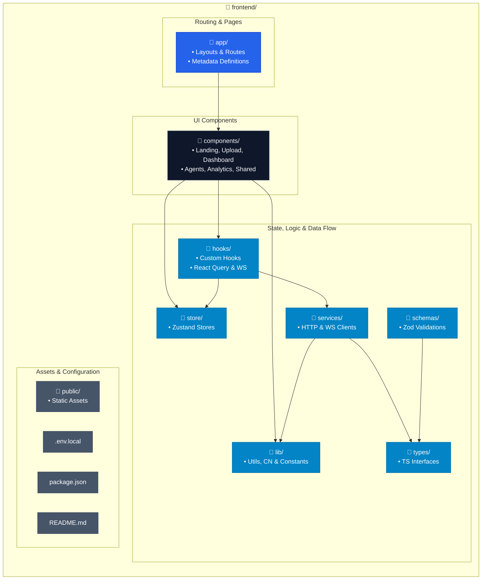
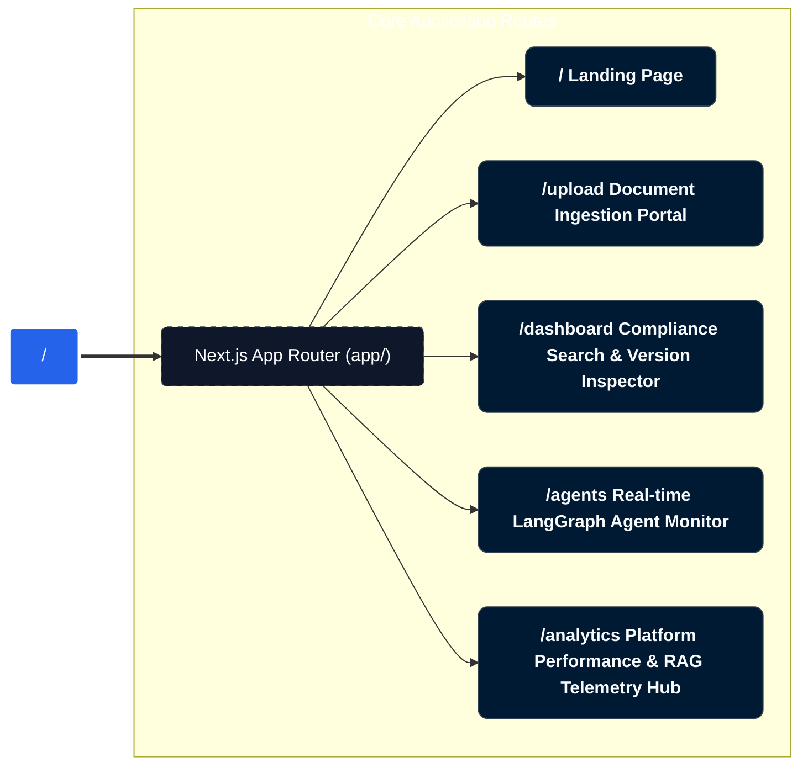
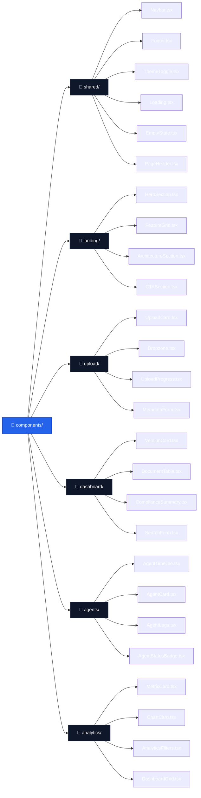
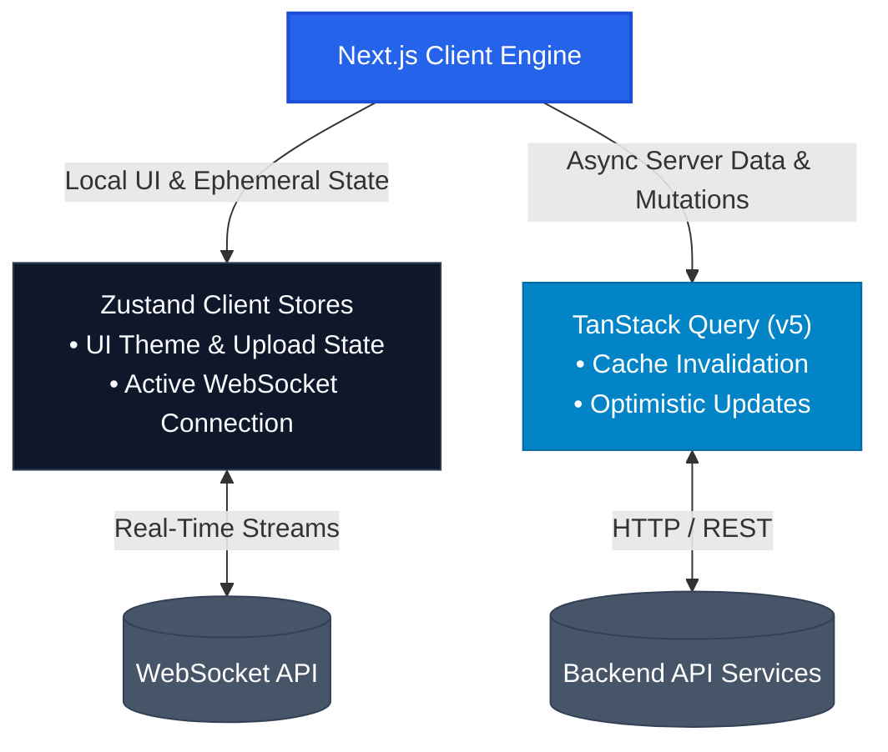
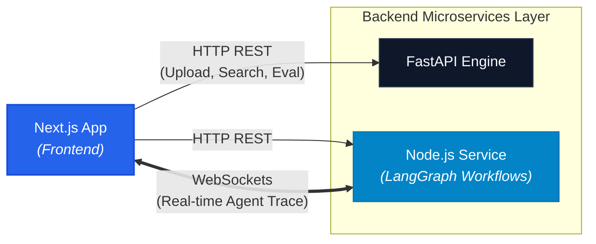

# Veridion Frontend

> Next.js 15 + React 19 frontend for the Veridion AI Regulatory Version Intelligence Platform.

[](https://nextjs.org/)
[](https://reactjs.org/)
[](https://www.typescriptlang.org/)
[](https://tailwindcss.com/)
[](https://github.com/pmndrs/zustand)
[](https://tanstack.com/query/v5)
[](https://recharts.org/)
[](https://ui.shadcn.com/)
[](https://www.framer.com/motion/)
[](https://react-hook-form.com/)
[](https://zod.dev/)

---

## Overview

The Veridion Frontend provides a high performance, real time interactive user interface for compliance teams, legal engineers, and regulatory analysts. It acts as the central command hub for document ingestion, version aware compliance searching, real time agent execution monitoring, and performance telemetry tracking.

### Core Parameters

- **Purpose**: Deliver an intuitive interface for inspecting versioned regulatory frameworks, tracking multi agent reasoning graphs, managing file uploads, and visualizing platform performance metrics.
- **Responsibilities**:
  - Handle multi-part regulatory document uploads with associated temporal metadata.
  - Render real time streaming updates from the Node.js LangGraph agent workflow via WebSockets.
  - Provide interactive search interfaces for parent child chunk retrieval and version comparisons.
  - Display analytics dashboards for cache performance, hallucination rates, and execution latencies.
  - Maintain fluid dark/light design systems with accessible components and responsive layouts.
- **Technologies**: Next.js 15 (App Router), React 19, TypeScript, TailwindCSS, shadcn/ui, Zustand, TanStack Query v5, Recharts, Framer Motion.
- **Design Goals**:
  - **User Interface**: Clean, enterprise ready dashboard layout using accessible primitives.
  - **SEO**: Fully optimized App Router dynamic metadata, OpenGraph tags, and structured JSON LD data.
  - **Form Handling**: Strict client side validation using React Hook Form backed by Zod schemas.
  - **Dashboard**: High-density data tables and real time visualization widgets.
  - **Analytics**: Comprehensive metric cards, trend charts, and cache execution graphs.
  - **Agent Monitoring**: Live node execution traces, progress bars, and streaming log outputs.
  - **Upload Experience**: Drag and drop file uploaders with file processing progress feedback.
  - **Performance**: Zero CLS layouts, Server Component rendering, streaming Suspense boundaries, and code split dynamic imports.

---

## Features

- **Landing Page**: Feature showcases, interactive platform architecture visualizations, and clear CTAs.
- **Version Dashboard**: Comparative view of active compliance acts, version deltas, and clause history.
- **Document Upload**: Multi-file dropzone supporting regulatory PDFs/documents with metadata forms (Sector, Region, Version, Effective Date).
- **Act Version Browser**: Deep-dive tree view into hierarchical parent child legal sections.
- **Agent Monitor**: Visual execution pipeline showing LangGraph agent nodes (`Legal Verifier`, `Summarizer`, `Visualizer`) with WebSocket progress updates.
- **Analytics Dashboard**: Live telemetric charts covering retrieval latency, vector cache hit rates, anti hallucination evaluation scores, and search volume trends.
- **Compliance Search**: Semantic search bar supporting HyDE query expansion preview, domain filtering, and cross encoder score visualization.
- **Real-time Agent Status**: Dynamic status badges (`Running`, `Idle`, `HITL Review Required`, `Completed`) updated over WebSockets.
- **Interactive Charts**: Custom Recharts wrappers for temporal timelines, cache hit distributions, and response time histograms.
- **Dark Mode**: Flawless system/manual theme switching powered by `next-themes` and CSS variables.
- **Responsive Layout**: Mobile first grid layouts supporting desktops, tablets, and mobile browsers.
- **SEO Optimized**: Fully compliant dynamic metadata generation, automated XML sitemap generation, and canonical routing.
- **Loading States**: Customized skeleton fallbacks (`shadcn/ui`) and inline loading indicators for high-LCP routes.
- **Error Handling**: Granular Error Boundaries, toast notifications for API failures, and clean fallback UI components.

---

## Tech Stack

- **Framework**: Next.js 15 (App Router), React 19, TypeScript
- **Styling**: TailwindCSS, shadcn/ui, Framer Motion
- **State Management**: Zustand, TanStack Query (v5)
- **Forms & Validation**: React Hook Form, Zod
- **Data Visualization**: Recharts
- **Icons**: Lucide React
- **File Upload**: React Dropzone
- **Theme Engine**: `next-themes`

---

## Folder Structure


---

## Folder Breakdown

- **`app/`**: Contains route segments, `layout.tsx` files, `page.tsx` entry points, `error.tsx` boundaries, `loading.tsx` skeletons, and metadata definitions for every page.
- **`components/`**: Houses modular UI logic divided into functional subdirectories (`ui/` for primitive shadcn components, `landing/`, `upload/`, `dashboard/`, `agents/`, `analytics/`, and `shared/`).
- **`hooks/`**: Encapsulates custom stateful logic, such as TanStack Query fetches (`useRetrievalQuery`), file ingestion pipelines (`useDocumentUpload`), and WebSocket connection management (`useAgentWebSocket`).
- **`store/`**: Contains lightweight Zustand global stores split by domain (e.g., UI preferences, live agent streaming state, global filters).
- **`schemas/`**: Stores single source of truth Zod validation contracts used by forms and API response handlers.
- **`types/`**: Contains TypeScript interfaces representing system models (`DocumentParent`, `ChildChunk`, `AgentNodeState`, `MetricSummary`).
- **`services/`**: Low level networking layer with pre configured Axios instances for FastAPI and Node.js REST routes, alongside resilient WebSocket wrappers.
- **`lib/`**: Generic helpers such as `utils.ts` for Tailwind class merging (`clsx` + `tailwind-merge`), date formatters, and formatting utilities.
- **`public/`**: Publicly accessible assets including SVG icons, static web app manifests, and OpenGraph social banner assets.

---

## Routing Architecture


---

## Page Breakdown

#### `/` — Landing Page
- **Responsibilities**: Displays hero branding, interactive system architecture overview, core capabilities breakdown, platform ROI metrics, call to action buttons, and baseline SEO metadata.

#### `/upload` — Ingestion Portal
- **Responsibilities**: Provides drag and drop document uploading for PDF/text acts, metadata extraction forms (Act Title, Version Identifier, Jurisdiction Region, Sector), real time upload progress, and immediate chunking verification.

#### `/dashboard` — Compliance Search & Version Inspector
- **Responsibilities**: Core workspace allowing compliance search over versioned acts. Features version comparative tools, form input verification, parent child context preview, and generated LLM answers.

#### `/agents` — LangGraph Live Agent Monitor
- **Responsibilities**: Visualizes real time execution of multi agent graphs. Features dynamic node graph progression (`Legal Verifier` $\to$ `Summarizer` $\to$ `Visualizer`), streaming log output streams, BullMQ HITL escalation prompts, and execution time tracking.

#### `/analytics` — Performance Telemetry Hub
- **Responsibilities**: Monitors end to end platform metrics including RAG search latency decomposition, Redis KV vector cache hit ratios, LLM anti hallucination score trends, and system throughput.

---

## Component Architecture

The component library is structured cleanly into domain modules:



---

## Component Inventory

- **Layout & Shared**:
  - `Navbar`: Main navigation header with active route highlights and status badges.
  - `Footer`: Platform link grid, repository links, system version, and copyright.
  - `ThemeToggle`: Accessible light/dark/system mode drop down.
  - `Container`: Consistent layout width wrapper.
  - `Loading`: Skeleton fallbacks and spinner states.
  - `EmptyState`: Generic empty data placeholder with graphic icons and reset actions.
  - `ErrorState`: Friendly error presentation with retry callbacks.
  - `PageHeader`: Title, subtitle, and primary page action layout.
  - `SectionTitle`: Standardized section header with accent badges.

- **Landing**:
  - `HeroSection`: Animated typography, call to action buttons, and platform highlights.
  - `FeatureGrid`: 3 column card grid detailing system features.
  - `ArchitectureSection`: Interactive workflow diagram illustrating FastAPI, Node.js, and Next.js data flow.
  - `CTASection`: Conversion section for starting local trials.

- **Upload**:
  - `UploadCard`: Outer card container wrapping dropzone and form controls.
  - `Dropzone`: React Dropzone container with drag over visual states and file validation.
  - `UploadProgress`: Animated percentage loader with file size and status indicators.
  - `MetadataForm`: Form inputs for Act Title, Version String, Region, and Sector tags.

- **Dashboard**:
  - `VersionCard`: Visual card highlighting version metadata, chunk counts, and release date.
  - `DocumentTable`: Filterable data table presenting chunk hierarchies.
  - `ComplianceSummary`: Formatted output container displaying RAG answers and source citations.
  - `SearchForm`: Search input bar equipped with sector filter chips and version dropdowns.

- **Agents**:
  - `AgentTimeline`: Vertical graph node tracker highlighting current execution steps.
  - `AgentCard`: Dedicated panel displaying agent status, input state, and output data.
  - `AgentLogs`: Monospaced, auto scrolling terminal window rendering WebSocket log frames.
  - `AgentStatusBadge`: Color coded pill badge (`Active`, `Idle`, `HITL`, `Error`).

- **Analytics**:
  - `MetricCard`: KPI display widget showing metric values, deltas, and trend indicators.
  - `ChartCard`: Card shell wrapping Recharts instances with legend controls.
  - `AnalyticsFilters`: Time range picker (1h, 24h, 7d, 30d) and metric granularity controls.
  - `DashboardGrid`: Responsive 12 column CSS grid layout for analytics cards.

---

## State Management

State is managed via domain specific **Zustand** stores for synchronous client UI states, paired with **TanStack Query (v5)** for async server state.



--- 

## Zustand Stores

1. **`themeStore`**:
   - *State*: Current theme (`light`, `dark`, `system`).
   - *Actions*: `setTheme(theme)`.
2. **`uploadStore`**:
   - *State*: Selected files, upload phase (`idle`, `uploading`, `processing`, `complete`), progress percentage, error states.
   - *Actions*: `addFiles()`, `removeFile()`, `setProgress()`, `reset()`.
3. **`dashboardStore`**:
   - *State*: Search query, selected act version, active sector filters, target region, highlighted source chunk IDs.
   - *Actions*: `setQuery()`, `setVersion()`, `setFilters()`, `resetFilters()`.
4. **`agentStore`**:
   - *State*: Active workflow execution ID, agent step list (`Legal Verifier`, `Summarizer`, `Visualizer`), WebSocket streaming log array, HITL review flag.
   - *Actions*: `updateAgentState()`, `appendLog()`, `setHITLRequired()`, `clearLogs()`.
5. **`analyticsStore`**:
   - *State*: Time range filter (`24h`, `7d`), metric collection toggles, selected chart hover points.
   - *Actions*: `setTimeRange()`, `toggleMetric()`.

---

## API Integration

The frontend interfaces with two backend services over HTTP and WebSockets:



### 1. FastAPI Engine (`http://localhost:8000`)
- **`POST /api/v1/ingest`**: Uploads document binaries and associated metadata.
- **`POST /api/v1/search`**: Executes HyDE expansion, vector retrieval, and cross encoder reranking.
- **`GET /api/v1/metrics`**: Fetches cache efficiency metrics, context precision, and evaluation scores.

### 2. Node.js Orchestrator (`http://localhost:4000` / `ws://localhost:4000`)
- **`POST /api/agents/run`**: Triggers a new LangGraph multi agent execution workflow.
- **`GET /api/analytics`**: Queries compiled workflow execution logs and queue status metrics.
- **`WS /ws/agent-monitor`**: Real time bi directional streaming channel pushing node execution updates, token streams, and HITL alerts.

---

## Form Handling & Validation

All user inputs are driven by **React Hook Form** paired with **Zod** schema resolvers to ensure client side validation before network submission.

```typescript
// Example Upload Validation Schema
import { z } from "zod";

export const UploadFormSchema = z.object({
  title: z.string().min(3, "Title must be at least 3 characters"),
  version: z.string().regex(/^v?\d+\.\d+(\.\d+)?$/, "Must be a valid version string (e.g. v1.0.0)"),
  sector: z.enum(["financial", "healthcare", "environmental", "general"]),
  region: z.string().min(2, "Region is required"),
  document: z.custom<File>((val) => val instanceof File, "Document file is required"),
});
```

---

## Standardized Forms

- Upload Form: Handles file selection alongside metadata fields (Title, Version, Sector, Region) with client side mime type checks.

- Search Form: Validates legal compliance search text input and domain context filters.

## Data Visualization

- The analytics suite uses Recharts wrapped in responsive, container aware cards:

- Industry Breakdown Chart: Bar chart summarizing regulatory query counts across business sectors.

- Version Timeline: Scatter/Line plot mapping historical amendments and regulatory updates over time.

- Cache Hits Distribution: Pie/Donut chart illustrating Redis KV embedding cache hit vs. miss ratios.

- Agent Latency Histogram: Stacked area chart showing latency decomposition across agent execution steps (Verifier vs Summarizer vs Visualizer).

- Evaluation Scores: Radial/Radar chart tracking RAG Triad scores (Faithfulness, Context Precision, Context Recall).

- Compliance Trend: Dual axis line chart depicting query volume vs. detected compliance error rates.

## Search Engine Optimization (SEO)

The frontend uses Next.js 15 App Router SEO metadata features:

- Metadata API: Static and dynamic metadata generation per route via generateMetadata().

- OpenGraph & Twitter Cards: Automated social preview card integration (og:image, twitter:card).

- Robots & Sitemap: Auto generated dynamic sitemap.ts and robots.ts serving /sitemap.xml and /robots.txt.

- Structured Data (JSON LD): Rich schema insertion (SoftwareApplication, Organization) for search engine parsing.

- Canonical URLs: Automated canonical URL tag injection to prevent duplicate content penalties.

- PWA Icons & Favicon: Multi resolution favicons, Apple touch icons, and manifest.webmanifest.

## Performance Optimizations

- Server Components (RSC): Layouts and static pages are rendered on the server to reduce client JavaScript bundle sizes.

- Streaming & Suspense: Critical dashboard routes stream components asynchronously using React Suspense boundaries.

- Lazy Loading & Dynamic Imports: Non critical heavy components (e.g., Recharts visualizers) are lazily loaded using next/dynamic.

- Image Optimization: Next.js ```<Image />``` component handles automatic WebP/AVIF formatting, responsive sizing, and lazy loading.

- Bundle Splitting: Optimized package imports to ensure clean tree shaking for icons and utility packages.

- Memoization: Heavy data transformation operations are wrapped using React useMemo and useCallback.

- Prefetching: Automatic link prefetching via Next.js ```<Link />``` for instant page transitions.

## Accessibility (a11y)


- Keyboard Navigation: Complete keyboard tab order navigation across all interactive elements, modals, and drop down menus.

- ARIA Labels: Explicit aria label, aria expanded, and aria live regions for streaming WebSocket log outputs.

- Semantic HTML: Strict use of standard semantic HTML tags ``` (<main>, <nav>, <header>, <article>, <section>)```.

- Focus Management: Visible focus rings (ring 2 ring primary) across focusable controls using Tailwind utilities.

- Color Contrast: WCAG 2.1 AA compliant contrast ratios across both dark and light modes.
  
---

## Environment Variables

- Create a .env.local file in the root of the frontend/ folder:

Code snippet

```bash

**API Endpoint Configurations**

NEXT_PUBLIC_NODE_API_URL=```http://localhost:4000```
NEXT_PUBLIC_FASTAPI_URL=```http://localhost:8000```
NEXT_PUBLIC_WS_URL=```ws://localhost:4000/ws/agent-monitor```

**Application Branding**

NEXT_PUBLIC_APP_NAME="Veridion"
NEXT_PUBLIC_APP_VERSION="1.0.0"

**Feature Flags**

NEXT_PUBLIC_ENABLE_ANALYTICS=true
NEXT_PUBLIC_ENABLE_AGENT_MONITOR=true

**UI Defaults**

NEXT_PUBLIC_DEFAULT_THEME=system

```

### Running Locally

- Prerequisites : Node.js: v20.0.0 or higher

- Package Manager: npm v10+ (or pnpm / yarn)

- Backend Services: Running instances of backend fastapi and backend node (via Docker Compose or local execution).

### Installation & Execution

Navigate to the frontend directory:

```Bash
cd frontend
```

Install dependencies:

```Bash
npm install
```
Configure Environment:

```Bash
cp .env.example .env.local
```
Launch development server:

```Bash
npm run dev
```

**Access Application**:

Open ```http://localhost:3000``` in your browser.

---

## Production Improvements

Note for Reviewers: The following production features represent planned enterprise frontend enhancements:

- Authentication & Authorization: Integration with NextAuth.js / Auth0 for OAuth2, OIDC, SAML single sign on (SSO), and route guard protection.

- Role Based Access Control (RBAC): Fine grained UI view permissions restricting admin panels, upload portals, and analytics to authorized roles.

- Internationalization (i18n): Translation routing using next intl supporting localized regulatory nomenclature.

- Progressive Web App (PWA) & Offline Support: Service worker caching strategies for offline view modes and local draft form persistence.

- Reporting Exports: Native PDF summary export generation and CSV raw metric downloading.

- Real Time Push Notifications: Web Push API integration for async BullMQ HITL escalation alerts.

- Enterprise Audit Logging: Granular UI event tracking and user behavior logging.

- End to End Testing & Component Documentation: Comprehensive E2E test suite using Playwright paired with an interactive Storybook component library.