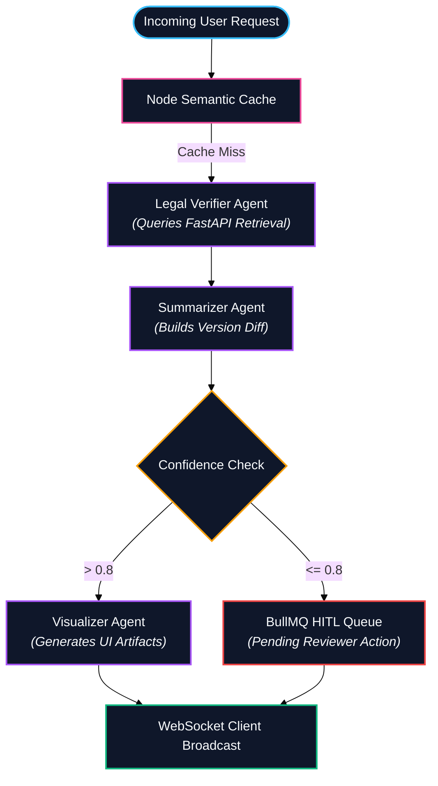
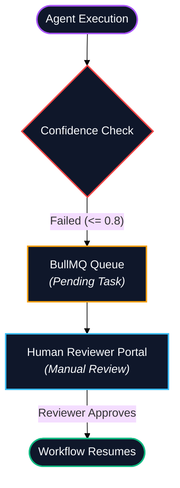
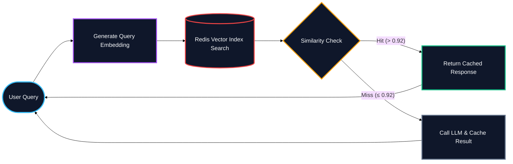

# Veridion Multi Agent Orchestrator (Node.js)

> Async multi agent workflow orchestration, LangGraph state machine execution, BullMQ queue management, and real time WebSocket streaming.

---

## Overview & Responsibilities

The Node.js orchestrator serves as the primary workflow coordinator for Veridion. Built on LangGraph, it executes state graph workflows using specialised agents, coordinates background tasks through BullMQ queues, checks semantic caches, and streams real time state updates to the UI via WebSockets.

### Core Responsibilities
- **LangGraph Agent Workflow**: Orchestrating multi agent state machines to verify legal clauses, draft compliance summaries, and format UI visualizers.
- **BullMQ Human in the Loop (HITL)**: Managing asynchronous queues for human compliance review when agent confidence drops below specified thresholds.
- **Semantic Caching**: Performing vector similarity checks in Redis to instantly return cached workflow outputs for similar queries.
- **WebSocket Gateway**: Streaming step-by-step agent execution nodes, token logs, and execution states to the Next.js client.
- **FastAPI Integration**: Driving downstream RAG retrieval, chunking, and evaluation requests via async HTTP.

---

## Agent Architecture

### Agent Roles & Specifications
1. **Legal Verifier Agent**
   - **Responsibilities**: Queries FastAPI RAG endpoints, verifies document version matches, and validates regulatory authority.
2. **Summarizer Agent**
   - **Responsibilities**: Computes version-to-version compliance deltas, highlights form requirements, and structures textual output.
3. **Visualizer Agent**
   - **Responsibilities**: Formats structured data models for rendering interactive timelines, form error maps, and comparison charts in the frontend.

---

## Human-in-the-Loop (HITL) Queue Flow

When an agent detects low retrieval confidence or potential version conflicts, it suspends execution and enqueues a job into BullMQ:

---

## Semantic Cache Strategy

Before delegating execution to the LangGraph engine, the Node service embeds the incoming query and performs a cosine similarity check against Redis stored workflow results:

---

## Real time WebSockets Interface

The WebSocket gateway (`/ws/agent-monitor`) streams real time execution states directly to the Performance Center and Live Agent Dashboard:

- `AGENT_START`: Triggered when an agent node receives control.
- `AGENT_STREAM_TOKEN`: Delta text tokens emitted during generation.
- `AGENT_COMPLETE`: Emitted upon node execution success.
- `HITL_REQUIRED`: Dispatched when execution halts for human approval.

---

## Production Improvements

The following architectural updates are planned for production scaling:

- **Connection Pooling (pgBouncer)**: In production, deploy pgBouncer between application services and PostgreSQL to reduce connection overhead, improve concurrency, and protect the database under high request volumes. This complements SQLAlchemy pooling and is especially valuable when running multiple FastAPI and Node.js instances.
- **Authentication & RBAC**: Implement WebSocket connection token validation and role based agent tool access control.
- **Supervisor Agent Architecture**: Transition linear LangGraph graphs to dynamic hierarchical supervisor topologies with planning capability.
- **Agent Memory Persistence**: Implement long term episodic and conversational memory backed by PostgreSQL.
- **Multi Agent Voting**: Introduce consensus voting nodes among multiple verifier agents to reduce false positives in legal analysis.